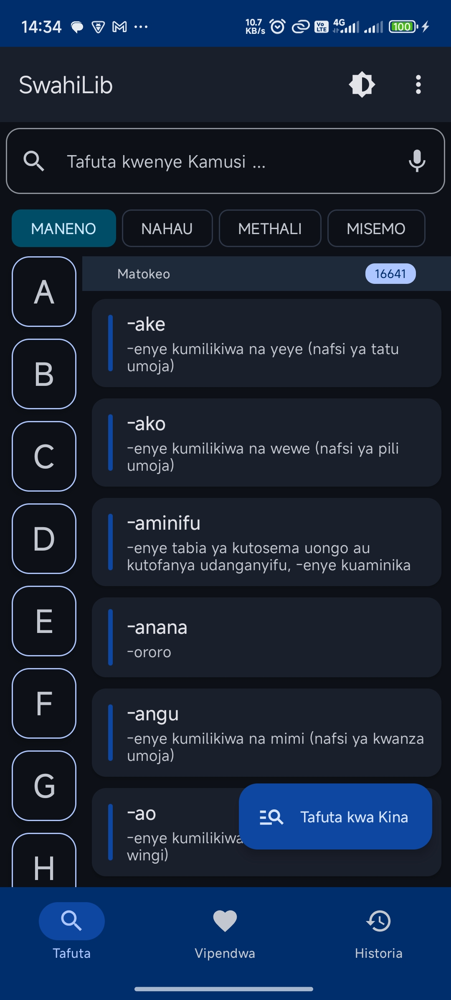
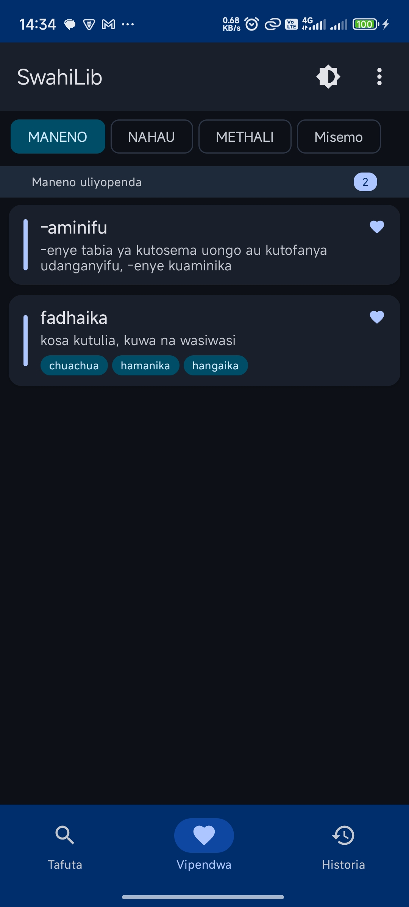
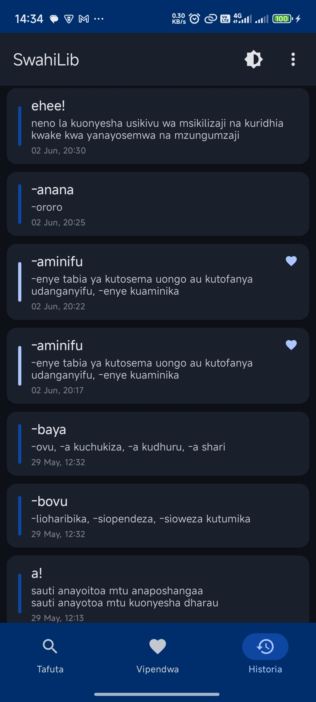
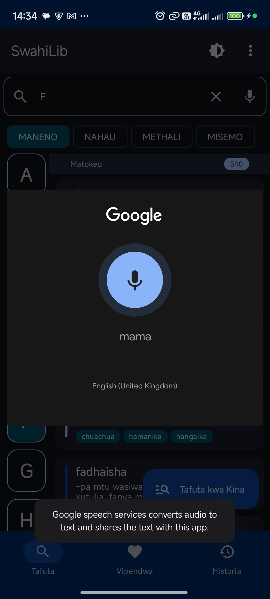

# SwahiLib - Kamusi ya Kiswahili

**SwahiLib** is a beautifully crafted Android app that lets users explore and search through a rich collection of **Swahili words, idioms, sayings, and proverbs**, with support for offline access, clean UI, and real-time updates.

This version is built using **Jetpack Compose**, **Room**, **Hilt**, and backed by **My Custome API** for remote data.

> 🔗 iOS Version Repo: [@SiroDaves/SwahiLib-iOS](https://github.com/SiroDaves/SwahiLib-iOS)

<a href='https://play.google.com/store/apps/details?id=com.swahilib'>
  
</a>

## ✨ Screenshots
<table>
    <tr>
        <td></td>
        <td></td>
        <td></td>
    </tr>
<tr>
        <td></td>
        <td></td>
        <td></td>
    </tr>
</table>

## ✨ Features

* 🔍 **Search** for Swahili **words**, **idioms**, **sayings**, and **proverbs**
* 📘 **View details** by tapping on any result

    * See **synonyms** for words and proverbs where available
* 💾 **Offline-first** support using **Room Database**
* 💉 **Dependency injection** powered by **Hilt**
* 💫 **Smooth animations** with **Lottie**

## 🧰 Tech Stack

### UI & Architecture

* Jetpack Compose (Material 3, Navigation, LiveData, Previews)
* Hilt for Dependency Injection
* Room for local database
* Kotlinx Serialization
* Retrofit & Ktor for HTTP networking
* Lottie Compose for animations

## 🚀 Getting Started

### 1. Clone the Repository

```bash
git clone https://github.com/SiroDaves/SwahiLib-Android.git
cd SwahiLibLib-Android
```

### 2. Open in Android Studio

Open the project in the latest version of **Android Studio** (Giraffe or later recommended for best Jetpack Compose support).


### 3. Build the Project

The app uses Gradle version catalogs for dependencies. Android Studio should sync and resolve everything automatically. If not, run:

```bash
./gradlew clean build
```

Or use **Sync Project with Gradle Files** in the IDE.

### 4. Run the App

Connect a physical Android device or use an emulator, then click **Run** or press:

```
Shift + F10
```

## 📄 Notes

* The app syncs content from the Api and stores it in Room for offline usage.
* Data updates are triggered automatically via ViewModel logic.
* All dependencies are managed using **libs.versions.toml** for cleaner and centralized version control.

## 📦 Main Libraries Used

| Category             | Library                                 |
| -------------------- | --------------------------------------- |
| UI                   | Jetpack Compose (Material2 & Material3) |
| DI                   | Hilt                                    |
| Database             | Room                                    |
| Animations           | Lottie Compose                          |
| Networking           | Ktor, Retrofit, OkHttp                  |
| Serialization        | kotlinx.serialization.json              |

## 🛠 License

This project is open-source and available under the [MIT License](LICENSE).
